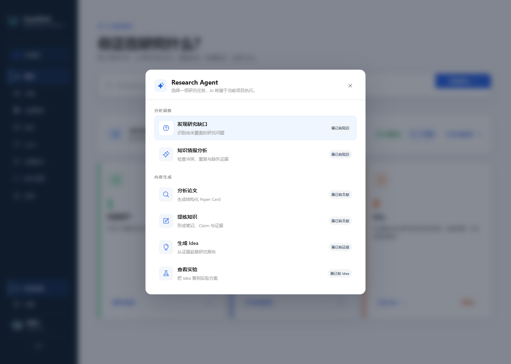
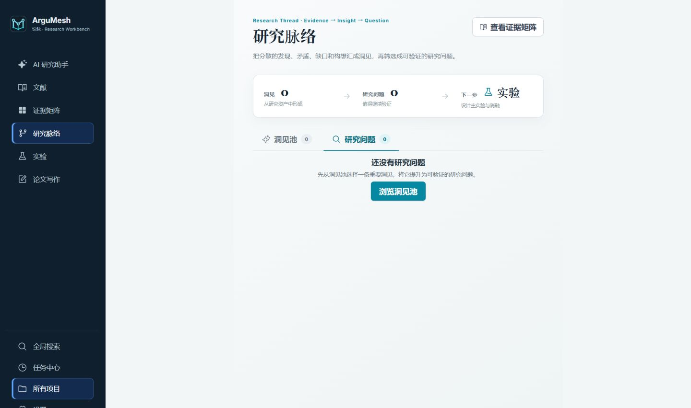
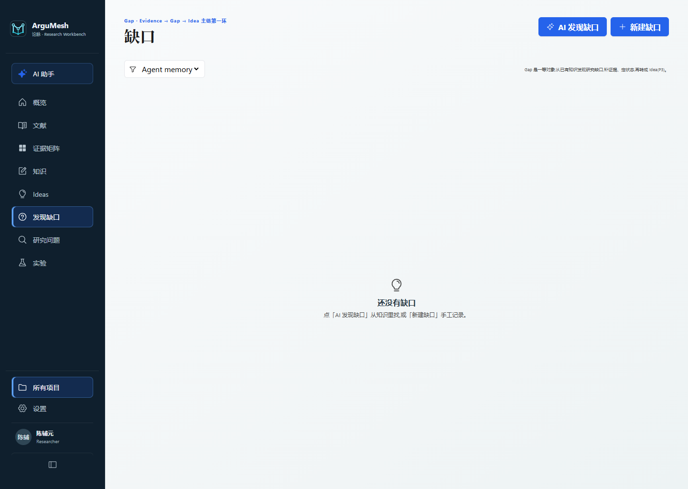
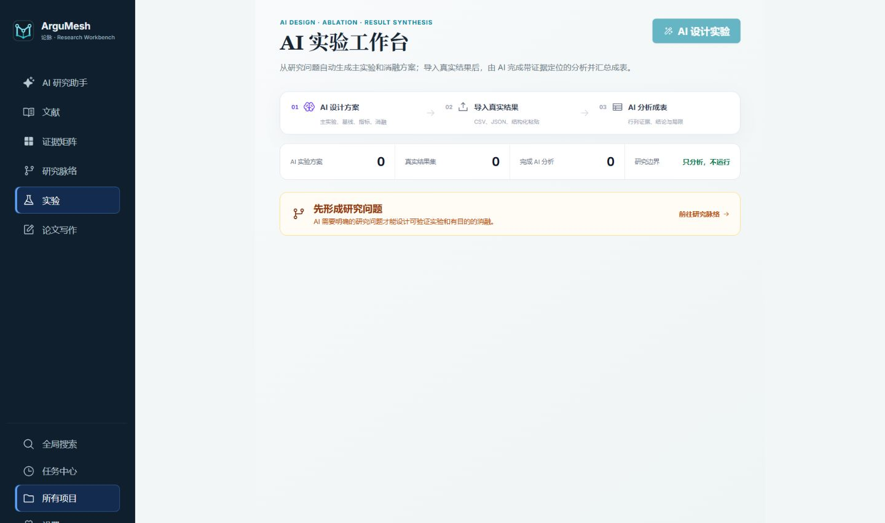
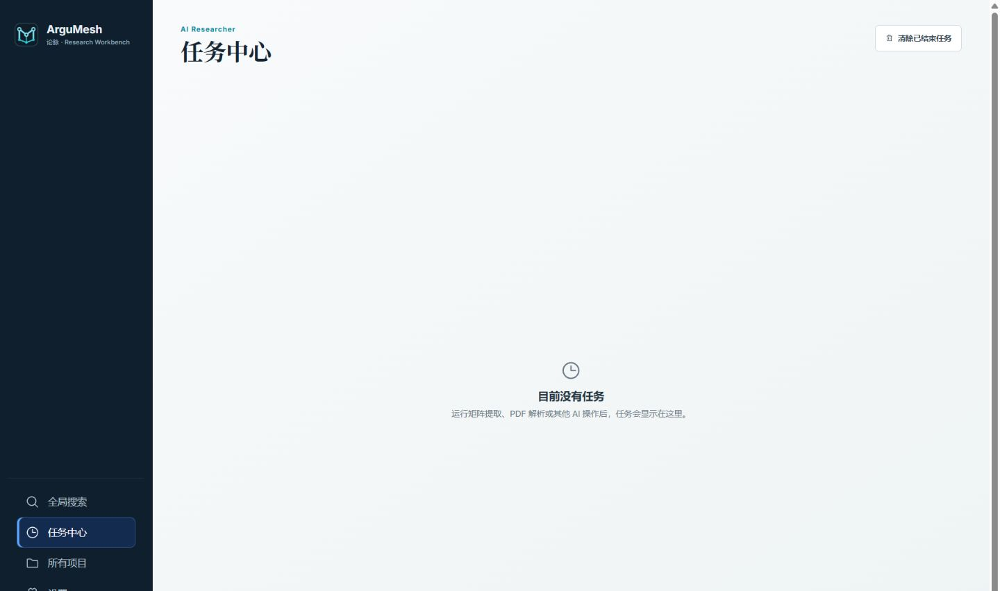
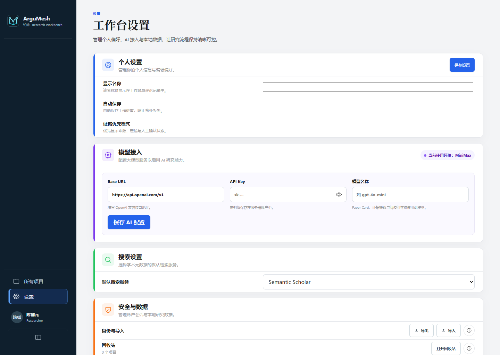

# ArguMesh (论脉)

<p align="center">
  
</p>

> Weave evidence into the thread of your research.

ArguMesh (Chinese name 「论脉」) is a **local-first, open-source research workbench** for researchers, graduate students, and paper authors. It puts the whole research loop — define a topic → collect papers → read & annotate → compare evidence → form ideas → plan experiments — into one traceable workflow, so you stop shuffling information between PDF readers, spreadsheets, note apps, and chat AI.

- **Zero cloud dependencies** — all data lives in a local SQLite file; no sign-ups, no vendor lock-in
- **Works out of the box** — `pnpm install && pnpm run dev`, no login required — open and start working
- **Ask an AI to deploy it** — paste the prompt in [Deploy with AI](#deploy-with-ai) into Cursor, Claude Code, Codex, or Copilot
- **Single-user** — no login, no accounts; a local-first workbench that runs on one machine
- **AI is optional** — plug in any OpenAI-compatible endpoint (OpenAI / DeepSeek / StepFun / local models); every manual workflow works without it

> Note: the interface is currently in Chinese. 中文文档见 [README.zh-CN.md](./README.zh-CN.md)。

## Features

### Project-first, AI-first workspace
Sign in and you land on your project list. Enter a project and the workspace scopes literature, evidence, knowledge, gaps, ideas, research questions, and experiments to that research context. The project home now starts with an AI research prompt and a compact overview of the assets already available to the agent.


### Research Agent
Open the Research Agent from anywhere in the workspace. It turns a research direction into explicit actions — discover gaps, analyze the knowledge base, organize literature, build an evidence matrix, develop ideas, or plan experiments — while preserving the active project context.



### Literature library
Import papers by DOI / arXiv ID / URL with automatic metadata, or batch-upload PDFs (≤ 25 MB each). Track reading status (待读 → 粗读 → 精读 → 核心文献), favorites, tags, and per-project notes.


### PDF reader with structured annotations
Built-in PDF reader with OCR. Select any passage and save it as a Note, Claim, or Evidence — the paper reference and page number stay attached. Ask the AI about a passage: only the text you selected, its page number, and your question are sent to the model — never the whole document.


### AI Paper Card
Generate a structured card for any paper: Problem, Method, Data, Findings, Limitations — each field with source excerpts, so every claim can be traced back to the paper.


### Evidence Matrix
The core of ArguMesh: papers as columns × research dimensions as rows. AI extraction fills every cell with evidence, confidence, and source location (page + excerpt). Then you verify: mark a cell 原文一致 (matches the source), 需要修订 (needs revision), or 标记冲突 (conflict), and 确认并锁定 (confirm & lock) the ones you trust. Locked cells are never silently overwritten by batch AI runs.


### Research arc: question → gap → idea → experiment
Research Questions act as the spine of a project. Evidence can be refined into explicit Gaps, developed into versioned Ideas, and turned into Experiments with executable plans and result tracking. Each stage keeps provenance instead of collapsing the workflow into a one-off AI chat.





### Idea workflow
Ideas move through a kanban board (Inbox → Draft → Reviewing → Approved → Experimenting → Writing → Archived). The Idea Canvas links Problem, Gap, Hypothesis, Method, Experiment, and Risks to the evidence behind them, and every save keeps a version history.




### Knowledge base
Notes, Claims, and Evidence in one place, linked to their papers and pages — the raw material your Ideas are built from.


### Global search
Search across projects from one box. Results stay in your local workspace.


### Task center
Every AI job (matrix extraction, PDF parsing…) shows its scope, model, progress, and result — and can be cancelled. No invisible batch processing.



### Accounts & isolation
### Bring your own AI
You configure a single OpenAI-compatible endpoint in Settings — Base URL (default `https://api.openai.com/v1`), API Key, and model name. Keys are stored server-side and never returned to the browser. With no AI configured, every manual workflow still works; AI features return a clear "AI not configured" notice pointing at the settings page.



## Why ArguMesh

| Common problem | How ArguMesh handles it |
| --- | --- |
| Papers scattered across folders, browsers, and note apps | Projects scope topics and their literature; search, filters, and tags keep them organized |
| Highlights and summaries never get reused | The reader saves selections as Note / Claim / Evidence with paper + page attached |
| Uploading whole PDFs to AI makes answers unverifiable | Reader Q&A submits only your selected passage, its page, and your question |
| Manual spreadsheets make paper comparison inconsistent | The Evidence Matrix standardizes dimensions; every cell carries source, confidence, and verification state |
| Notes, claims, evidence, and ideas are disconnected | The knowledge base unifies them; the Idea Canvas links them into hypotheses and experiments |
| Batch AI work is opaque and hard to retrace | The task center records scope, model, progress, and results |

## Deploy with AI

If you use [Cursor](https://cursor.com), [Claude Code](https://claude.com/claude-code), Codex, Copilot, or another coding agent that can run commands in this repo, paste the prompt below and let it install, seed, and start ArguMesh. The agent should also read [`CLAUDE.md`](./CLAUDE.md) — that file is the project runbook for coding agents.

```
Deploy ArguMesh (论脉) locally from this repository.

This is a local-first Node.js + SQLite app. Do not add Cloudflare Workers, wrangler, or Turso.

1. Prerequisites: Node.js ≥ 20. If pnpm is missing, run `corepack enable`.
2. Read CLAUDE.md, README.md, and .env.example in the repo root.
3. From the repo root, run `pnpm install`.
4. `.env` is optional. Do not invent or commit API keys. Copy `.env.example` to `.env` only if the user wants to set DATABASE_URL or AI providers.
5. Run `pnpm run db:seed` (idempotent: creates tables + a demo project (no accounts)).
6. Start the app:
   - Development (default): `pnpm run dev` → frontend http://localhost:5173 , API 127.0.0.1:8787
   - Single-port production-style: `pnpm run build` then `pnpm start` → http://127.0.0.1:8787
7. Tell the user to open the URL and start working (no login required).

On Windows PowerShell 5.x, chain commands with `;` not `&&`.
Do not expose the server to the public internet unless the user explicitly asks — there is no authentication, so any network access is unrestricted.
Do not start extra services. Confirm the app is up by hitting GET /api/health.
```

Manual steps for humans are in [Deployment](#deployment) below.

## Deployment

Requires Node.js ≥ 20 and pnpm.

```bash
pnpm install
pnpm run db:seed   # create local DB + demo project (safe to re-run; no accounts)
pnpm run dev       # dev mode: API on 127.0.0.1:8787, frontend on http://localhost:5173
```

Open <http://localhost:5173> and start working (no login required).

Production (single port serving frontend + API):

```bash
pnpm run build     # type-check + build frontend to dist/
pnpm start         # http://127.0.0.1:8787
```

All configuration is optional — see `.env.example`:

- `DATABASE_URL` — defaults to `file:./data/argumesh.db`; remote `libsql://` URLs also work
- `AI_PROVIDERS` / `STEPFUN_*` — environment-level AI fallback (the global settings take precedence)
- (no auth — single-user local workbench; `APP_ACCESS_TOKEN` was removed)

> ⚠️ By default ArguMesh listens on localhost only with **no authentication**. For a public deployment, restrict network access and put HTTPS in front (e.g. Caddy / Nginx) — there is no auth layer.

## Changelog

### v0.1 — Foundation research workbench
- React 19 + Vite 6 frontend, Hono 4 (`@hono/node-server`) backend, local SQLite (libSQL `file:`) + Drizzle.
- Single-user: no accounts, no authentication, no data isolation layer.
- Project → Literature (DOI / arXiv / URL import, batch PDF ≤ 25 MB, reading status) → Evidence Matrix (papers × dimensions, AI extraction + human verification with locking).
- PDF reader (pdf.js + OCR), selection-based notes, Paper Card, global search, task center.
- Migrations 0000–0007 (0000-0006 core, 0007 research arc). The `accounts` table and `owner_id` columns were dropped in the 2026-08-25 single-user port (via `scripts/migrate-custom.ts`); `ai_settings` is now a single global row.

### v0.2 — AI-first reshape
- Extracted the `server/ai/` AI capability layer (`completeJson` / `completeText` primitives + centralized prompts), slimming routes; unified Zod validation + provenance for all AI output.
- Three-entry AI workbench: a Sidebar "AI assistant" trigger, a ProjectHome AI Hero, and a Research Agent launcher (command palette opened via the sidebar button / hero form — not a keyboard shortcut).
- Single global AI config (Settings page: Base URL / API Key / model; key server-side only), overriding the env fallback.
- Reader AI (summarize / translate / ask) — submits only the selected text, page, and question (minimal exposure).
- Workflow-style sidebar: main rail "Overview / Library / Matrix / Ideas" + "All projects", with downstream tools folded under "More".

### v3.2 — Research arc and AI-first workspace (2026-08-24)
- **Research Core**: `research_questions` as the spine + `rq_papers` many-to-many linking.
- **Knowledge → Gap → Idea → Experiment** chain, each a first-class object with a state machine and provenance (`source` / `model` / `generatedAt`).
- **Evidence Layers**: refine a quote through `raw → interpretation → implication`, with explicit user-triggered promotion into knowledge / gap / idea.
- Migration `0007_last_deathbird` adds 13 research-arc tables. Run `pnpm run db:migrate` (or a fresh `db:seed`) to apply.
- (No admin/multi-account features — this is a single-user local workbench.)

## Data & backup

- Database: `data/argumesh.db` (SQLite / libSQL) — projects, papers, evidence, and PDFs (BLOBs in `paper_files`, ≤ 25 MB per file)
- Backup: `pnpm run db:backup` exports a JSON snapshot to `backups/`; Settings also offers workspace JSON export/restore

## Tech stack

```
React 19 + TypeScript + Vite 6        frontend SPA
Hono 4 + @hono/node-server            API (plain Node process, no cloud bindings)
libSQL / SQLite + Drizzle ORM         all data (including PDFs) in one local file
(no auth)                                 single-user, no accounts, no native dependencies
pdfjs-dist + tesseract.js             in-browser PDF rendering + OCR
Any OpenAI-compatible API             AI extraction / reader Q&A / Paper Card (optional)
```

## Project structure

```
src/               # React frontend (pages, components, state, PDF reader)
server/            # Hono API (node.ts entry; routes/ by module)
  auth/            # (removed in the single-user port — no auth)
  db/              # Drizzle schema + client (cached by connection URL)
  routes/          # auth / users / ai / projects / papers / library /
                   # matrix / files / extraction / card / reader
scripts/           # seed, migrate, backup
drizzle/           # SQL migrations (drizzle-kit generated)
tests/unit/        # frontend unit tests (happy-dom)
tests/api/         # API tests (app.request + temporary SQLite)
docs/              # brand guidelines + README screenshots
```

## Tests

```bash
pnpm run test                                # all tests
pnpm run test:watch                          # watch mode
pnpm exec vitest run tests/api/users.test.ts # single test file
```

API tests call the Hono app directly with a fresh temporary SQLite database per test file — no external services required.

## License

[MIT](./LICENSE)
