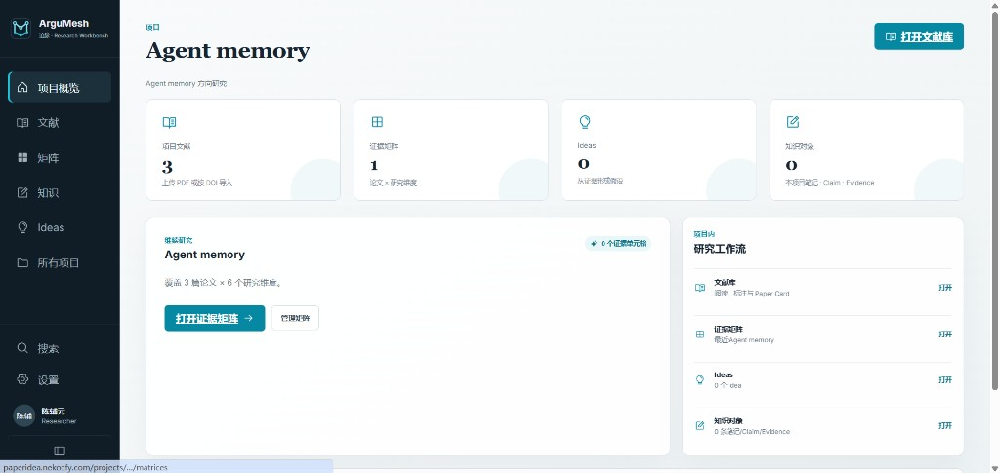
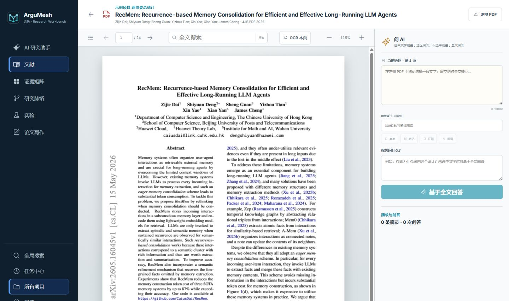
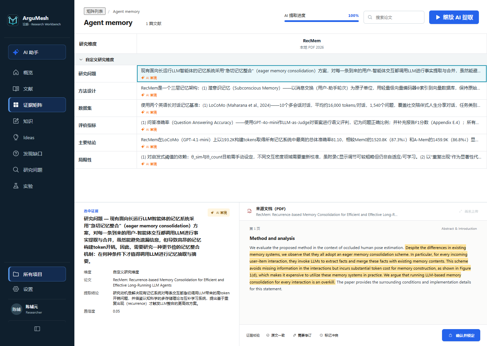
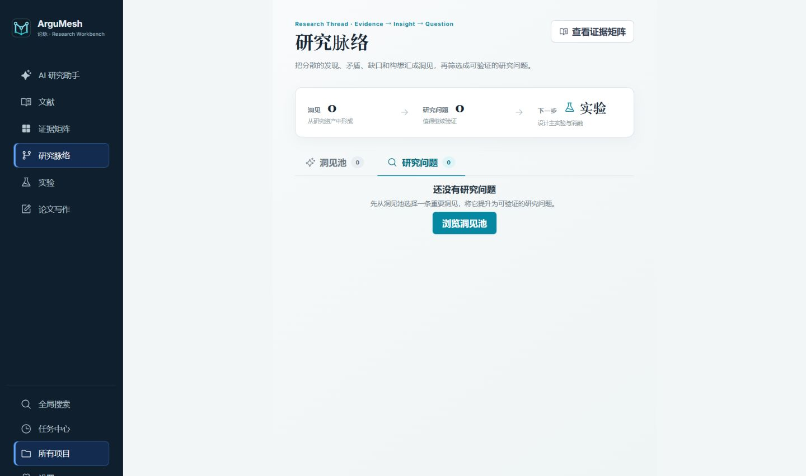
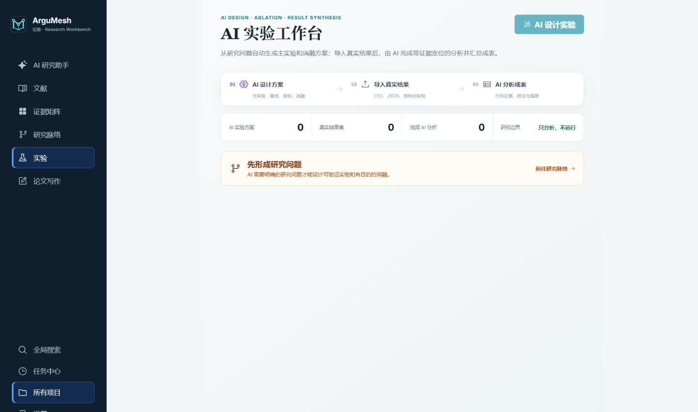
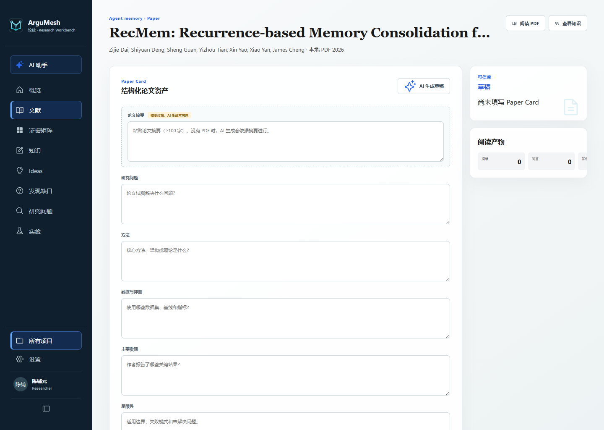

<p align="center">
  
</p>

<h1 align="center">ArguMesh · 论脉</h1>

<p align="center"><strong>把证据连成研究脉络。</strong></p>

<p align="center">
  <a href="./README.en.md">English</a> · <strong>简体中文</strong> · <a href="https://github.com/Fyuan0206/ArguMesh/releases">Releases</a> · <a href="./LICENSE">MIT</a>
</p>

<p align="center">
  <a href="#解决的问题">为什么选择论脉</a> · <a href="#功能特性">功能特性</a> · <a href="#界面预览">界面预览</a> · <a href="#下载安装">下载安装</a> · <a href="#文档索引">开发文档</a> · <a href="#交流群">交流群</a>
</p>


ArguMesh(中文名「论脉」)是一个**本地优先、开源**的文献研究工作台,面向科研人员、研究生和论文作者。从文献到论文写作，让每一步都有证据可追溯。

减少在 PDF 阅读器、表格、笔记软件和聊天式 AI 之间反复搬运信息。

<p align="center">文献 → 证据矩阵 → 研究脉络 → 实验 → 论文写作</p>

- **本地 SQLite**：零云依赖，无需账号或登录。
- **AI 可选**：自带模型 API，不配置也能使用人工流程。
- **内容由你确认**：AI 建议保留来源，确认与锁定后的证据受到保护。

## 🤝 项目致谢

<details open>
<summary>感谢阶跃星辰提供模型 API 支持</summary>

感谢 [阶跃星辰（StepFun）](https://www.stepfun.com/) 在开发与评测期间提供支持。

<p align="center">
  <a href="https://www.stepfun.com/">
    
  </a>
</p>

</details>

## 解决的问题

| 常见问题 | ArguMesh 的处理方式 |
| --- | --- |
| 论文分散在文件夹、浏览器和笔记软件中,难以按课题管理 | 用 Project 隔离课题与文献,支持搜索、筛选与标签;绑定工作区后 **`literature/` 文件夹同步** 可免上传批量导入 PDF |
| 阅读论文容易停留在划线和摘要,后续无法复用 | 在 PDF 阅读器中把选区保存为 Note、Claim 或 Evidence,保留论文与页码 |
| 直接向 AI 上传整篇论文,答案范围不透明 | 阅读问答只提交用户主动选择的原文、页码和问题;双语对照只提交当前页的分段,且必须点过「精确解析并翻译全文」才会发出,绝不整篇上传 |
| 多篇论文靠手工表格横向比较,维度不统一、证据出处易丢失 | 证据矩阵以论文为列、研究维度为行,证据可核验、确认、锁定或标记冲突 |
| 笔记、缺口、构想和研究问题散落在多个工具里 | 研究脉络统一洞见与研究问题,并保留溯源 |
| 实验与写作和证据脱节 | 实验结果分析与 LaTeX 写作引用项目证据,并可跳回工作区对象 |
| AI 批处理过程不可见,失败后难以追踪 | 任务中心与 Research Agent 记录范围、模型、动作与结果 |

## 功能特性

| 环节 | 能力 |
| --- | --- |
| 文献 | DOI / arXiv / PDF 导入、文件夹同步、阅读与批注 |
| 证据 | Paper Card、证据矩阵、来源追溯、确认与锁定 |
| 研究 | 洞见与研究问题、项目上下文 Research Agent |
| 实验与写作 | 实验设计、结果分析、LaTeX 编辑与 Diff 审阅 |

<details>
<summary>展开完整功能说明</summary>

### 项目优先的工作区 + Research Agent
打开后进入项目列表。进入项目后,侧栏按研究阶段组织:**AI 研究助手 → 文献 → 证据矩阵 → 研究脉络 → 实验 → 论文写作**。

项目首页是可持续对话的 **Research Agent**，底层为 [Pi](https://pi.dev/docs/latest/sdk) `AgentSession`（`@earendil-works/pi-coding-agent`）：多步工具循环，装配有界项目上下文（文献、证据矩阵、研究脉络、实验结果、论文源文件）。领域白名单工具可创建洞见草稿、关联 RQ 证据、设计实验、提出论文 Diff、安全编译 LaTeX 等，并给出可跳转回工作区的引用。内置编程工具（bash / write / edit）关闭；写入只产生草稿。

### 文献库
按 DOI / arXiv / URL 导入文献(自动获取元数据),或批量上传 PDF(单文件 ≤ 25 MB)。支持阅读状态(待读 → 粗读 → 精读 → 核心文献)、收藏、标签与项目内笔记。列表可多选后**批量删除**(与单行删除相同:确认后永久移除 PDF、证据与关联知识,跨项目一并清理)。

**文件夹同步(`literature/` 收件箱)** — 若项目已绑定本地工作文件夹(`workspacePath`),可将 PDF 放入固定子目录,在文献库一键导入:

```text
你的项目文件夹/
├── paper/              ← LaTeX 写作(main.tex、references.bib)
├── literature/         ← 把 PDF 放这里,再到文献库点「同步」
└── .argumesh/          ← 内部快照(由 ArguMesh 管理)
```

1. 创建或编辑项目时绑定工作文件夹(原生文件夹选择器)。
2. 将 PDF 放入 `{workspacePath}/literature/`(当前仅扫描该目录下一层,不递归子文件夹)。
3. 打开该项目的 **文献** 页,点击 **「同步 literature/」**。

服务端从磁盘读取 PDF,按文件哈希(SHA-256)去重,将元数据与 PDF 本体写入本地数据库并关联到当前项目。再次同步会跳过已在项目中的文献;其他项目已导入的同一文件会关联到当前项目,不会重复存盘。**从文件夹删除 PDF 不会删除文献库记录**(证据矩阵等关联保留)。限制:每次同步最多 50 个文件,单文件 ≤ 25 MB。

API:`POST /api/projects/:projectId/library/scan-inbox`(需已设置 `workspacePath`)。

### PDF 阅读器:结构化标注
内置阅读器(pdf.js + OCR)。**选中原文任意片段,选区旁即浮出气泡**,翻译 / 高亮 / 笔记 / 证据一步到位:

- **划词翻译** — 译文直接内联显示在气泡里(侧栏卡片保留最近一次结果)。只提交选中原文、页码与论文标题,绝不整篇上传;同一句重复翻译直接命中内存缓存,零成本。单次上限 8000 字符——够一句、一段,不够一整页:超长选区会被明确拒绝(侧栏字数计数器同时变红),不会被静默截断。整篇翻译使用下方的左右论文对照功能。
- **原文高亮 + 锚定批注** — 高亮 / 笔记 / 证据按选中位置在 PDF 原文上绘出彩色标记。标记以 PDF 页面单位存储,缩放、翻页、刷新后仍锚定在原处;点击标记即可回到侧栏对应批注继续编辑。
- **左右论文对照** — 阅读器默认左侧显示原文 PDF，右侧显示当前页译文；两边翻页一致、滚动同步。快速解析根据 PDF 文字坐标与行距保留段落、章节标题及单栏/双栏结构。点击一次**精确解析并翻译全文**后，会用**本机安装的 MinerU 3.x**逐页解析并翻译整篇论文；模型每次只接收正在处理的单页分段，最多 3 项并行。工具栏显示总页数、模型、进度和取消；已完成的页自动缓存，重新点击会跳过已译内容。解析期间可取消：恢复表格行列与跨行单元格，仅翻译文字单元格，表格数字先锁定再原样恢复，模型标识保持原样；公式保留原图。图片保留原图，并在本机 OCR 图中文字后，只把识别出的短文字送去翻译；纯图形含义不会由文字模型推断。工具栏只保留这一个解析与翻译入口；未安装 MinerU 时会提示安装。本地解析结果按 PDF 哈希缓存，重开本页自动恢复，译文按解析版本分开存入 IndexedDB。只有点击翻译按钮才发送当前页分段或图内 OCR 文字，显示进度并可取消，不上传整篇论文给翻译模型。扫描版 PDF 可用**OCR 本页**，其版面只能近似还原；右侧仍可切回**批注与问答**。

保存选区为 Note、Claim 或 Evidence 时,论文与页码随之保留;阅读问答只提交你主动选中的原文、页码和问题,绝不整篇上传。

### AI Paper Card
为每篇论文生成结构化卡片:问题 / 方法 / 数据 / 发现 / 局限,每个字段附原文出处摘录,可回溯核对。

### 证据矩阵(核心)
论文为列 × 研究维度为行。AI 提取逐格填入证据、置信度与来源位置(页码 + 摘录);然后人工核验:标记「原文一致」「需要修订」或「标记冲突」,可信的格子「确认并锁定」。锁定的格子不会被批量 AI 运行静默覆盖。文献较多(如 50 篇以上)时,矩阵以**横向滚动**展示,左侧研究维度列固定,列宽按篇数自动收窄;可用顶栏搜索框筛选论文。

### 研究脉络
一个页面承载研究脊柱,含两个子视图:

- **洞见池** — 发现 / 矛盾 / 缺口 / 构想(统一呈现原先分散的知识、缺口、Idea 等对象)
- **研究问题** — 可将洞见提升为 RQ,挂接证据,并跟踪状态(待研究 → 分析中 → 已有证据 → 已形成结论)

每条 AI 草稿保留溯源(`source` / `model` / `generatedAt`);已确认内容不会被静默覆盖。

### 实验工作台
用 AI 辅助设计主实验与消融实验,导入 CSV / JSON / 粘贴结果,并做带证据引用的结果分析。ArguMesh **不会替你跑实验**——它负责规划、导入与解读。每次分析可将结论草稿 append-only 回挂到对应研究问题。

### 论文写作(LaTeX)
为项目绑定本地工作文件夹,编辑 `main.tex` / `references.bib`,保留快照,接受前先审阅 AI Diff;可选调用本机 Tectonic 或 latexmk 编译并预览真实 PDF。危险命令会被拦截;接受正文 Diff 后可自动编译,编译问题可再生成修复 Diff。

同一 `workspacePath` 下还有可选的 **`literature/` PDF 收件箱**(见[文献库](#文献库)):写作源文件在 `paper/`,待导入 PDF 放在 `literature/`。

### 全局搜索与任务中心
一个搜索框覆盖全部项目与文献。每个长耗时 AI 任务展示范围、模型、进度与结果,可取消。

### 自带 AI 配置
在「设置」页配置 OpenAI 兼容接口——Base URL(默认 `https://api.openai.com/v1`)、API Key、模型名称。Base URL 以 `/anthropic` 结尾时自动走 Anthropic Messages API。密钥只存服务端,永不回传浏览器。未配置 AI 时全部人工流程照常可用,AI 功能返回指向设置页的「AI 未配置」提示。

</details>

## 界面预览

| 研究助手 | 文献阅读 | 证据矩阵 |
| --- | --- | --- |
|  |  |  |

| 研究脉络 | 实验工作台 | 论文卡片 |
| --- | --- | --- |
|  |  |  |

点击图片可查看大图。

## 下载安装

不想碰命令行?每个 [GitHub Release](https://github.com/Fyuan0206/ArguMesh/releases) 都附带预构建的 Windows 安装包:

| 文件 | 适用 |
| --- | --- |
| [`ArguMesh_3.3.0_x64-setup.exe`](https://github.com/Fyuan0206/ArguMesh/releases/tag/v3.3.0) | Windows 10/11 x64 —— 约 30 MB,`currentUser` 安装,**不需要管理员权限** |

**请更新到 v3.3.0：** 下载新安装包，关闭 ArguMesh 后覆盖安装，现有研究数据和已保存的 AI 配置会保留。桌面版启动时查询 GitHub 最新正式版，提供可关闭的下载提醒；也可在 **设置 → 应用更新 → 检查更新** 手动检查。检查不发送研究内容，网络失败不影响使用。v3.2.5 没有应用内检查功能，请先手动更新一次。精确 PDF 翻译需另外安装本机 MinerU 3.x。

> ⚠️ **安装前必须知道的三件事**
>
> 1. **安装包里是空库。** 你的项目、文献、证据和 AI 配置都**不在**安装包里。首次安装后请到**设置页**填写 AI 提供方(Base URL / API Key / 模型名)——在此之前,第一次用到 AI 功能会提示「未配置」。
> 2. **没有代码签名。** Windows SmartScreen 会提示发布者未知——这是预期行为,不是缺陷。点「**更多信息 → 仍要运行**」。
> 3. **应用没有鉴权。** 它只监听 localhost,但所有 `/api/*` 路由都可直接访问。**不要把它的端口暴露到不可信网络。**

### 安装步骤

1. 在 Release 页面下载 `.exe`。
2. 双击安装。`currentUser` 模式**不需要管理员权限**;安装器语言可选 English / 简体中文。
3. 启动。首次启动可能较慢(**8–75 秒**)——杀毒软件在扫随包的 Node sidecar,壳最多等 90 秒。

### 数据存放在哪

安装器**只在首次启动时**把一份空库复制到 `%LOCALAPPDATA%\ArguMesh\data\argumesh.db`;已存在的数据库一律不动——升级或重装都不会丢你的项目。想清空重来:卸载后删掉这个文件夹。

排错入口:`%LOCALAPPDATA%\ArguMesh\sidecar.log`,记录 sidecar 路径、PID 与全部 stderr。

### 不用 Windows?

从源码跑即可——见下方[部署](#部署)(`pnpm install` → `pnpm run db:seed` → `pnpm run dev`),或把[让 AI 部署](#让-ai-部署)的提示词发给编程助手。

桌面版是包在同一份 Hono 应用外面的 Tauri 薄壳,功能与 Web 版完全一致。想自己构建,见 [`docs/DEPLOYMENT.md`](docs/DEPLOYMENT.md) 第 3 节。

## 部署

要求:Node.js ≥ 20 与 pnpm。

```powershell
pnpm install
pnpm run db:seed   # 创建本地数据库 + 演示项目(可重复运行;无账号)
pnpm run dev       # 开发模式:API(127.0.0.1:8787)+ 前端(http://localhost:5173)
```

打开 <http://localhost:5173> 即可开始使用——**无需登录**。

生产模式(单端口,同时提供前端与 API):

```powershell
pnpm run build     # 类型检查 + 构建前端到 dist/
pnpm start         # http://127.0.0.1:8787
```

所有配置均可选(参考 `.env.example`):

- `DATABASE_URL` — 默认 `file:./data/argumesh.db`;也支持远程 `libsql://` 地址
- `AI_PROVIDERS` / `STEPFUN_*` — 环境级 AI 兜底配置(设置页的全局配置优先)
- `SEARXNG_BASE_URL` — 可选自托管 SearXNG 根地址，供 Research Agent `web_search`（需启用 JSON 格式）
- `SEARXNG_TIMEOUT_MS` — 可选 SearXNG 超时（默认 20000）

> ⚠️ 安全提示:默认仅监听本机,且**无任何鉴权**——任何能访问该端口的人都能读写全部数据。请勿把 API 端口暴露到不可信网络。若部署到公网,务必用反向代理(如 Caddy / Nginx)提供 HTTPS 并限制网络访问。

可选:若需要应用内 LaTeX 编译与 PDF 预览,请在本机安装 [Tectonic](https://tectonic-typesetting.github.io/) 或 `latexmk`。

## AI 配置(可选)

你可以在「设置」页直接配置任意 OpenAI 兼容服务(OpenAI / DeepSeek / StepFun / 本地模型等);Base URL 以 `/anthropic` 结尾时会自动使用 Anthropic Messages API。密钥保存在服务端数据库、永不下发前端。也可以在 `.env` 里配置环境级兜底:

```dotenv
# 方式一(推荐):JSON 数组,可配多家
AI_PROVIDERS=[{"id":"stepfun","label":"StepFun","baseUrl":"https://api.stepfun.com/v1","apiKey":"sk-...","models":["step-3.7-flash"]}]

# 方式二:单家 StepFun 兼容配置
# STEPFUN_BASE_URL=https://api.stepfun.com/v1
# STEPFUN_API_KEY=sk-...
# STEPFUN_MODEL=step-3.7-flash
```

不配置 AI 时,全部人工流程(文献管理、阅读笔记、证据矩阵人工核验、研究脉络整理、实验导入与解读、论文编辑)完全可用。

<details>
<summary>使用编程助手部署（展开提示词）</summary>

## 让 AI 部署

如果你在用 [Cursor](https://cursor.com)、[Claude Code](https://claude.com/claude-code)、Codex、Copilot、Trae 等能在本仓库里执行命令的编程助手,把下面这段提示词原样发给它,让它完成安装、初始化数据库并启动。助手还应阅读 [`CLAUDE.md`](./CLAUDE.md)——那是给 coding agent 的项目手册。

```
请在本仓库本地部署 ArguMesh(论脉)。

这是一个本地优先的 Node.js + SQLite 应用。不要引入 Cloudflare Workers、wrangler 或 Turso。

1. 前置条件:Node.js ≥ 20。若没有 pnpm,先执行 `corepack enable`。
2. 阅读仓库根目录的 CLAUDE.md、README.zh-CN.md(或 README.md)和 .env.example。
3. 在仓库根目录执行 `pnpm install`。
4. `.env` 可选。不要编造或提交 API Key。仅当用户要自定义 DATABASE_URL 或 AI 服务时,才从 `.env.example` 复制为 `.env`。
5. 执行 `pnpm run db:seed`(可重复运行:建表 + 演示项目,无账号)。
6. 启动:
   - 开发模式(默认):`pnpm run dev` → 前端 http://localhost:5173 ,API 127.0.0.1:8787
   - 单端口生产模式:`pnpm run build` 然后 `pnpm start` → http://127.0.0.1:8787
7. 告诉用户打开上述地址即可开始使用(无需登录)。

若当前是 Windows PowerShell 5.x,命令之间用 `;` 连接,不要用 `&&`。
除非用户明确要求公网部署,否则不要把服务暴露到公网。**本版本无任何鉴权**,任何能访问该端口的人都能读写全部数据;若要公网部署,务必用反向代理(Caddy / Nginx)提供 HTTPS 并限制网络访问。
不要额外启动其他服务。用 GET /api/health 确认服务已起来。
```

人工逐步安装见下方 [部署](#部署)。

</details>

## 更新记录

版本历史已迁移到 **[`CHANGELOG.md`](CHANGELOG.md)**（英文条目在前，中文以 `<details><summary>中文</summary>` 折叠块给出）。其中包含 2026-09 文档期的阅读器 / 文献库更新、v3.2.5 Research Agent 网页搜索、v3.2.4 Evidence → Idea 闭环加固、v3.2.3 / v3.2.2 Pi 作为 Research Agent 底座、v3.2.1 文献文件夹同步、v3.2.0 研究工作台收敛、v0.3.0 研究弧、v0.2.0 AI-first 形态重塑，以及 v0.1.0 基础研究工作台。

> 新增用户可见功能时，请在同一个任务内向 `CHANGELOG.md` 追加条目——见 [`AGENTS.md`](AGENTS.md#文档规则强制)。

## 数据与备份

- 数据库:`data/argumesh.db`(SQLite / libSQL 文件),项目、文献、证据、研究脉络、实验、AI 会话与 PDF(BLOB,单文件 ≤ 25 MB)都在这里
- 项目工作区(可选,磁盘上的 `workspacePath`):
  - `paper/` — LaTeX 源文件(`main.tex`、`references.bib`、figures),供论文写作
  - `literature/` — PDF 收件箱,文献库一键同步(见[文献库](#文献库))
  - `.argumesh/` — 论文快照(由 ArguMesh 管理)
- 备份:`pnpm run db:backup` 导出全库 JSON 快照到 `backups/`;前端「设置」页也支持工作区 JSON 导出/恢复

## 技术栈

```
React 19 + TypeScript + Vite 6(前端 SPA)
Hono 4 + @hono/node-server(API,本地 Node 进程,无云绑定)
libSQL / SQLite + Drizzle ORM(结构化数据与 PDF 均存本地文件)
pdfjs-dist + tesseract.js(浏览器端 PDF 渲染与 OCR)
OpenAI 或 Anthropic 兼容 API(Research Agent / 提取 / 阅读问答 / 写作,可选)
Tectonic 或 latexmk(可选,本地 LaTeX 编译与 PDF 预览)
```

## 项目结构

```
src/               # React 前端(页面、组件、状态、PDF 阅读器)
server/            # Hono API(node.ts 入口;routes/ 按模块划分)
  ai/              # AI 原语与 prompts
  db/              # Drizzle schema 与客户端
  routes/          # projects / papers / library / matrix / files / extraction /
                   # card / reader / knowledge / researchQuestions / gaps / ideas /
                   # reviews / experiments / evidenceLayers / researchThread /
                   # conversations / writing / ai / system
  services/        # research-agent、latex、paper-files、literature-inbox、project-context 等
scripts/           # seed、migrate、migrate-custom、backup
drizzle/           # SQL 迁移(0000–0007;单用户化由 migrate-custom 处理)
tests/unit/        # 前端单元测试(happy-dom)
tests/api/         # API 测试(app.request + 临时 SQLite)
docs/              # 文档(见下方索引)
website/           # 公开静态官网(独立 Cloudflare Worker)
src-tauri/         # 可选的 Tauri 桌面壳 + Node sidecar
```

### 文档索引

| 文件 | 内容 |
| --- | --- |
| [`AGENTS.md`](AGENTS.md) | 面向所有编码 agent 的协作与开发规范 |
| [`CLAUDE.md`](CLAUDE.md) | Claude Code 指引:命令、架构、不变量 |
| [`PROJECT-SPEC`](docs/PROJECT-SPEC.md) | 项目定位、功能范围、明确不做什么 |
| [`ARCHITECTURE`](docs/ARCHITECTURE.md) | 代码组织、29 张表、路由与服务、数据组织 |
| [`PAGE-STRUCTURE`](docs/PAGE-STRUCTURE.md) | 路由、旧链接兼容、各页面行为 |
| [`COMPONENT-GUIDELINES`](docs/COMPONENT-GUIDELINES.md) | 共享组件、CSS token、无障碍 |
| [`DEVELOPMENT`](docs/DEVELOPMENT.md) | 命令、环境变量、双轨迁移、测试布局 |
| [`DEPLOYMENT`](docs/DEPLOYMENT.md) | 本地 / 公开官网 / 桌面安装包 |
| [`DESIGN`](DESIGN.md) | 视觉方向、设计令牌、QA 记录 |
| [`CHANGELOG`](CHANGELOG.md) | 版本历史(英文 + 中文) |
| [`TODO`](TODO.md) | 当前进度、已暂缓项、已知欠账 |

`docs/` 下另有:[`brand-guidelines.md`](docs/brand-guidelines.md)、[`reference-projects.md`](docs/reference-projects.md)，以及[分发调研决策记录](docs/DISTRIBUTION-RESEARCH-2026-09-20.md)(已暂缓)。

## 测试

```bash
pnpm run test                                      # 全部测试
pnpm run test:watch                                # watch 模式
pnpm exec vitest run tests/api/writing.test.ts     # 单个 API 测试文件
```

API 测试直连 Hono 应用并为每个测试文件创建独立的临时 SQLite 库,不需要任何外部服务。

## 交流群

欢迎加入微信群 **ArguMesh | AI学术工具**,讨论产品使用、提需求 / 报 bug、交流研究工作流。请用微信扫码加入:

<p align="center">
  
</p>

> 二维码更新于 2026 年 10 月 7 日，按微信提示于 10 月 14 日前有效。若二维码过期，请开 Issue 或查看 README 的最新更新。

## 参考项目

设计路线图时对照过这些开源与商业产品（仅摘要与链接，**未内置其源码**）。完整对照表见 **[docs/reference-projects.md](./docs/reference-projects.md)**。

| 项目 | 一句话 |
| --- | --- |
| [ARIS](https://github.com/wanshuiyin/Auto-claude-code-research-in-sleep) | Skill 驱动的「睡觉做科研」全流程：文献 → idea → 实验 → 写作 → 审稿 |
| [karpathy/autoresearch](https://github.com/karpathy/autoresearch) | 单卡上 agent 自主改代码、跑指标、保留改进的实验闭环 |
| [pi-autoresearch](https://github.com/davebcn87/pi-autoresearch) | 把 autoresearch 接到 pi 终端 agent（`.auto/` 可恢复会话） |
| [Mimir](https://github.com/1692775560/Mimir) | DeepSeek Harness 插件：文献 / 实验 / 写作 / 组会八视图工作台 |
| [Open Science Desktop](https://github.com/ai4s-research/open-science)（[中文](https://github.com/ai4s-research/open-science/blob/master/README.zh.md)） | 本地优先、模型无关的 AI 科研桌面工作台（Tauri + MCP + skills） |
| [小绿鲸](https://www.xljsci.com/) | 商业英文文献阅读器：学科翻译、速读、笔记、引用与汇报 PPT |
| [Agentero](https://github.com/poco-ai/agentero) | Agent 原生本地文献工作台（Vault + ACP BYOA + Zotero / PDF / 双链） |

ArguMesh 侧重**本地 SQLite + 证据优先的结构化对象**；上述多偏 agent / skill / 阅读产品 / 自动实验，可互为补充而非替代。

## License

[MIT](./LICENSE)
