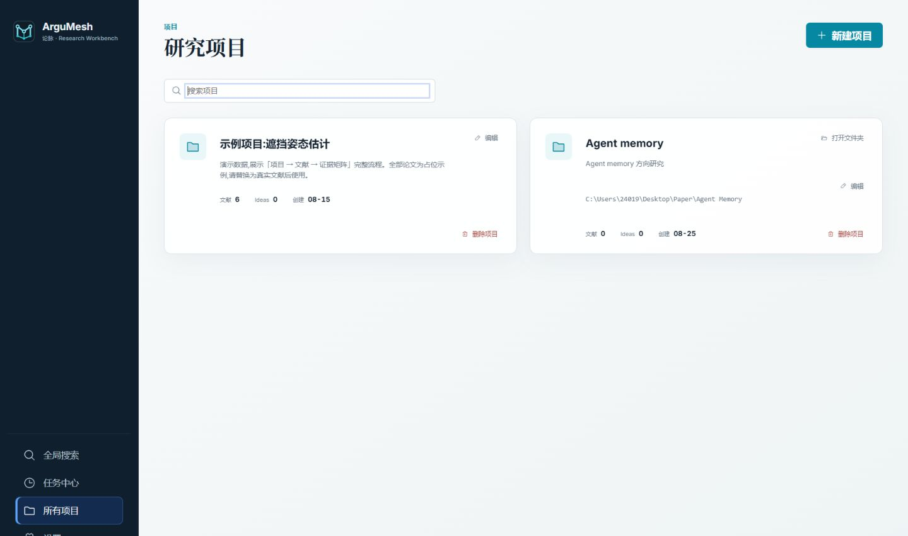
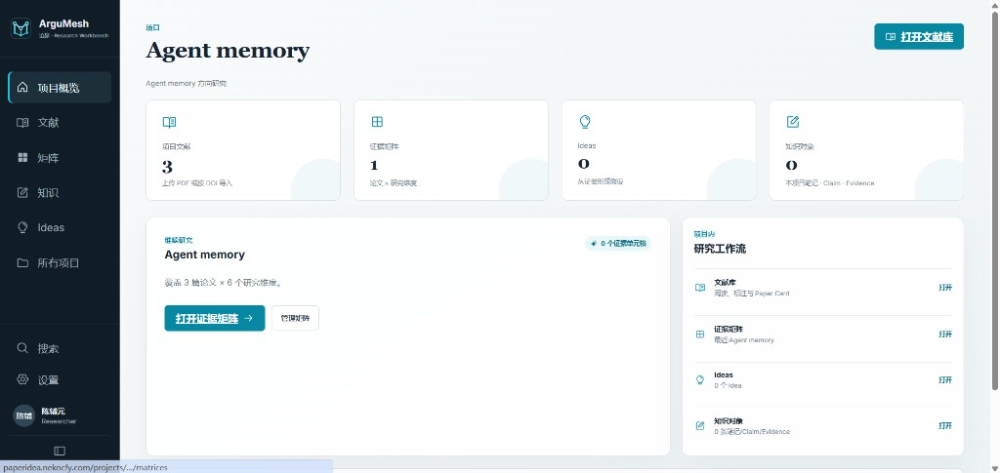
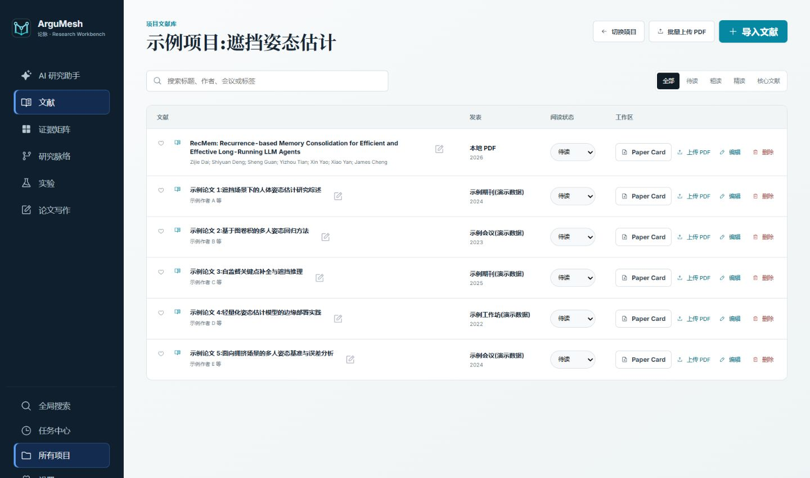
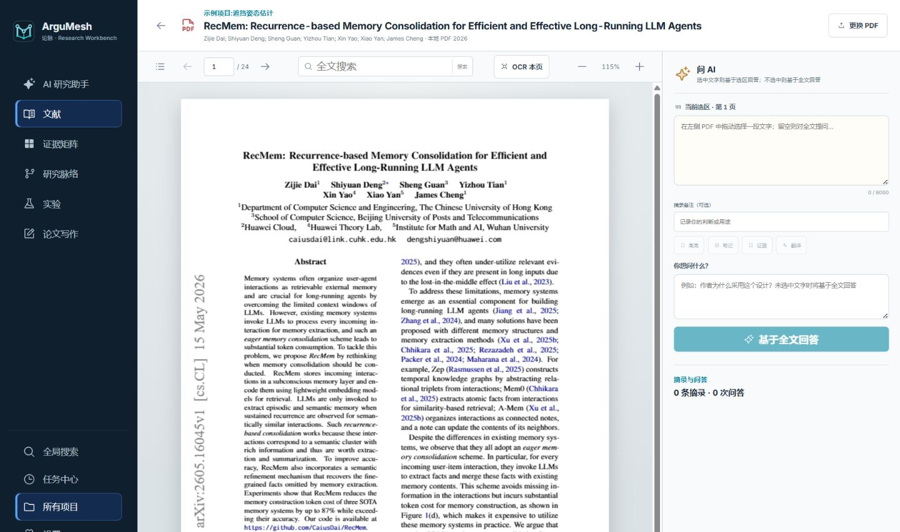
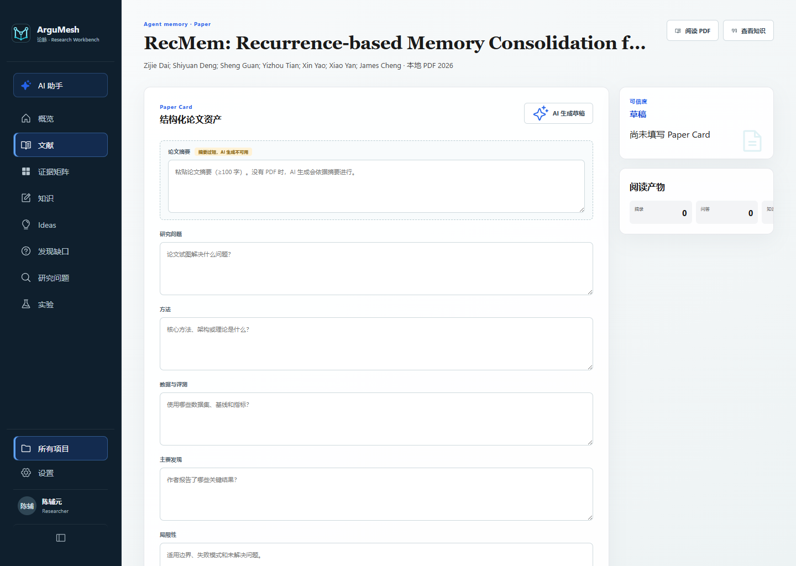
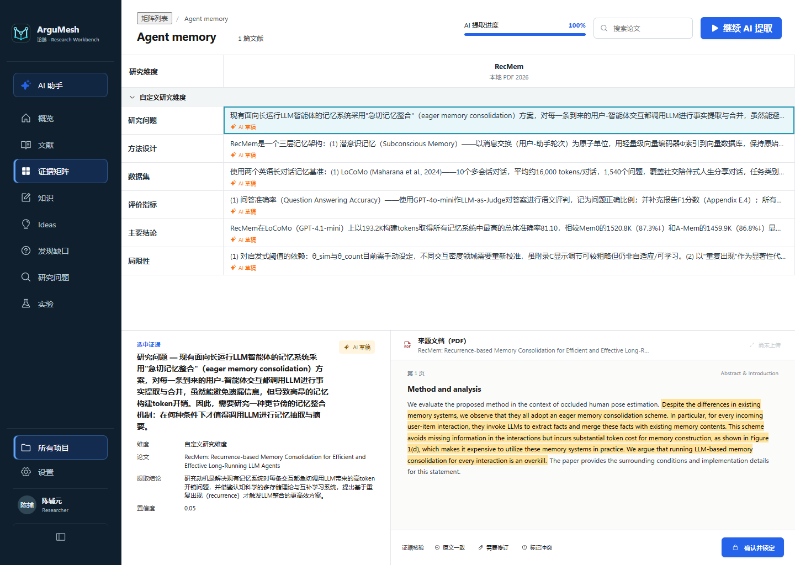
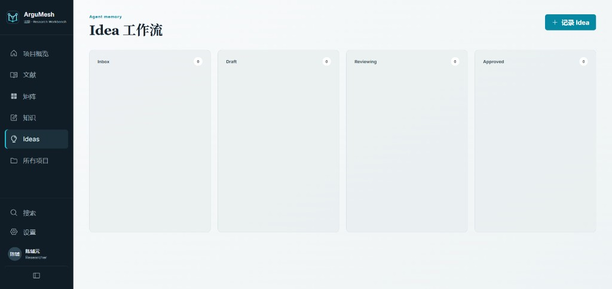
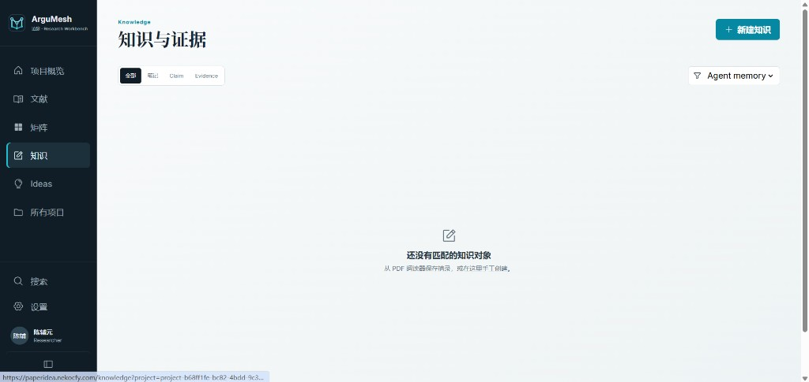
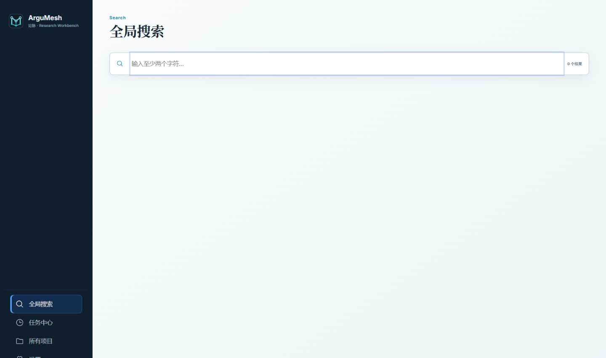

# ArguMesh(论脉)

<p align="center">
  
</p>

> 把证据连成研究脉络。

ArguMesh(中文名「论脉」)是一个**本地优先、开源**的文献研究工作台,面向科研人员、研究生和论文作者。它把「建立课题—收集论文—精读与摘录—比较证据—形成观点—设计研究方案」放进同一个可追溯的工作流,减少在 PDF 阅读器、表格、笔记软件和聊天式 AI 之间反复搬运信息。

- **零云依赖**:数据全部保存在本地 SQLite 文件,不需要注册任何云服务
- **开箱即用**:`pnpm install && pnpm run dev` 即可启动,无需登录
- **可让 AI 代为部署**:把 [让 AI 部署](#让-ai-部署) 中的提示词发给 Cursor / Claude Code / Codex / Copilot 等编程助手即可
- **单用户**:无需登录、无需账号;一台机器上即可运行的本地优先工作台
- **AI 可选**:接入任意 OpenAI 兼容 API(OpenAI / DeepSeek / StepFun / 本地模型等),不配置也能使用全部人工流程

## 功能特性

### 项目优先的工作区
打开后直接进入项目列表;点进一个项目,文献、证据矩阵、Ideas 全部在项目内部组织,跨项目工具(知识库、任务中心、全局搜索)始终留在侧边栏。





### 文献库
按 DOI / arXiv / URL 导入文献(自动获取元数据),或批量上传 PDF(单文件 ≤ 25 MB)。支持阅读状态(待读 → 粗读 → 精读 → 核心文献)、收藏、标签与项目内笔记。



### PDF 阅读器:结构化标注
内置阅读器(pdf.js + OCR)。选中原文任意片段,保存为 Note、Claim 或 Evidence,论文与页码随之保留;阅读问答只提交你主动选中的原文、页码和问题,绝不整篇上传。



### AI Paper Card
为每篇论文生成结构化卡片:问题 / 方法 / 数据 / 发现 / 局限,每个字段附原文出处摘录,可回溯核对。



### 证据矩阵(核心)
论文为列 × 研究维度为行。AI 提取逐格填入证据、置信度与来源位置(页码 + 摘录);然后人工核验:标记「原文一致」「需要修订」或「标记冲突」,可信的格子「确认并锁定」。锁定的格子不会被批量 AI 运行静默覆盖。



### Idea 工作流
Ideas 沿看板流转(Inbox → Draft → Reviewing → Approved → Experimenting → Writing → Archived);Idea Canvas 连接问题、Gap、假设、方法、实验与风险及其背后的证据,每次保存保留版本历史。



### 知识库
Note、Claim、Evidence 统一管理,链接到论文与页码——Idea 的原始素材。



### 自带 AI 配置
你可在「设置」页配置自己的 OpenAI 兼容接口——Base URL(默认 `https://api.openai.com/v1`)、API Key、模型名称。密钥只存服务端,永不回传浏览器。未配置 AI 时全部人工流程照常可用,AI 功能返回指向设置页的「AI 未配置」提示。

### 全局搜索
一个搜索框覆盖全部项目与文献,结果始终限定在本地工作区。



### 任务中心
每个 AI 任务(矩阵提取、PDF 解析……)展示范围、模型、进度与结果,可取消。批处理全程可见。

### 单用户本地版
无登录、无账号。所有数据存在本地 `data/argumesh.db`,只有使用这台机器的人能访问。

### 自带 AI 配置
你可在「设置」页配置自己的 OpenAI 兼容接口——Base URL(默认 `https://api.openai.com/v1`)、API Key、模型名称。密钥只存服务端,永不回传浏览器。未配置 AI 时全部人工流程照常可用,AI 功能返回指向设置页的「AI 未配置」提示。

## 解决的问题

| 常见问题 | ArguMesh 的处理方式 |
| --- | --- |
| 论文分散在文件夹、浏览器和笔记软件中,难以按课题管理 | 用 Project 隔离课题与文献,支持搜索、筛选与标签 |
| 阅读论文容易停留在划线和摘要,后续无法复用 | 在 PDF 阅读器中把选区保存为 Note、Claim 或 Evidence,保留论文与页码 |
| 直接向 AI 上传整篇论文,答案范围不透明 | 阅读问答只提交用户主动选择的原文、页码和问题 |
| 多篇论文靠手工表格横向比较,维度不统一、证据出处易丢失 | 证据矩阵以论文为列、研究维度为行,证据可核验、确认、锁定或标记冲突 |
| 笔记、主张、证据和研究想法彼此割裂 | 知识库统一管理 Note、Claim、Evidence;Idea Canvas 连接问题、Gap、假设、方法、实验与风险 |
| AI 批处理过程不可见,失败后难以追踪 | 任务中心记录范围、模型、进度与结果,可取消 |

## 让 AI 部署

如果你在用 [Cursor](https://cursor.com)、[Claude Code](https://claude.com/claude-code)、Codex、Copilot、Trae 等能在本仓库里执行命令的编程助手,把下面这段提示词原样发给它,让它完成安装、初始化数据库并启动。助手还应阅读 [`CLAUDE.md`](./CLAUDE.md)——那是给 coding agent 的项目手册。

```
请在本仓库本地部署 ArguMesh(论脉)。

这是一个本地优先的 Node.js + SQLite 应用。不要引入 Cloudflare Workers、wrangler 或 Turso。

1. 前置条件:Node.js ≥ 20。若没有 pnpm,先执行 `corepack enable`。
2. 阅读仓库根目录的 CLAUDE.md、README.zh-CN.md(或 README.md)和 .env.example。
3. 在仓库根目录执行 `pnpm install`。
4. `.env` 可选。不要编造或提交 API Key。仅当用户要自定义 DATABASE_URL 或 AI 服务时,才从 `.env.example` 复制为 `.env`。
5. 执行 `pnpm run db:seed`(可重复运行:建表 + 演示项目,无账号)。
6. 启动:
   - 开发模式(默认):`pnpm run dev` → 前端 http://localhost:5173 ,API 127.0.0.1:8787
   - 单端口生产模式:`pnpm run build` 然后 `pnpm start` → http://127.0.0.1:8787
7. 告诉用户打开上述地址即可开始使用(无需登录)。

若当前是 Windows PowerShell 5.x,命令之间用 `;` 连接,不要用 `&&`。
除非用户明确要求公网部署,否则不要把服务暴露到公网。**本版本无任何鉴权**,任何能访问该端口的人都能读写全部数据;若要公网部署,务必用反向代理(Caddy / Nginx)提供 HTTPS 并限制网络访问。
不要额外启动其他服务。用 GET /api/health 确认服务已起来。
```

人工逐步安装见下方 [部署](#部署)。

## 部署

要求:Node.js ≥ 20 与 pnpm。

```powershell
pnpm install
pnpm run db:seed   # 创建本地数据库 + 默认管理员 + 演示项目(可重复运行)
pnpm run dev       # 开发模式:API(127.0.0.1:8787)+ 前端(http://localhost:5173)
```

打开 <http://localhost:5173> 即可开始使用(无需登录):

| 用户名 | 密码 | 角色 |
| --- | --- | --- |
| (无) | (无) | 单用户,无需登录 |

(单用户本地版,无需登录,不存在默认密码。)

生产模式(单端口,同时提供前端与 API):

```powershell
pnpm run build     # 类型检查 + 构建前端到 dist/
pnpm start         # http://127.0.0.1:8787
```

## 更新记录

### v0.1 — 基础研究工作台
- React 19 + Vite 6 前端,Hono 4(`@hono/node-server`)后端,本地 SQLite(libSQL `file:`)+ Drizzle。
- 单用户本地版:无账户、无鉴权、无数据隔离层。
- 项目 → 文献(DOI/arXiv/URL 导入、批量 PDF ≤ 25 MB、阅读状态)→ 证据矩阵(论文 × 维度,AI 提取 + 人工核验锁定)。
- PDF 阅读器(pdf.js + OCR)、划选笔记、Paper Card、全局搜索、任务中心。
- 迁移 0000–0007(0000-0006 核心,0007 研究弧)。`accounts` 表与 `owner_id` 列已在 2026-08-25 单用户化时移除(经 `scripts/migrate-custom.ts`);`ai_settings` 现为单行全局配置。

### v0.2 — AI-first 形态重塑
- 抽出 `server/ai/` AI capability layer(completeJson / completeText 原语 + 集中 prompts),route 瘦身,AI 输出统一 Zod 校验 + provenance。
- 三入口 AI 工作台:Sidebar「AI 助手」触发点、ProjectHome AI Hero、Cmd+K 命令面板(Research Agent launcher)。
- 单条全局 AI 配置(设置页,Base URL / API Key / 模型,密钥只存服务端),优于环境变量兜底。
- 阅读器阅读/划选 AI(概括、翻译、问答),只提交选中原文 + 页码 + 问题,最小暴露。
- 侧栏 Workflow 化:主栏「概览 / 文献 / 矩阵 / Ideas」+「所有项目」,下游能力收进「更多」折叠。

### v3.2 — 研究弧与 AI-first 工作台(2026-08-24)
- **Research Core**:以 `research_questions` 为脊柱 + `rq_papers` 多对多关联。
- **知识 → 缺口 → Idea → 实验**主链,每个对象都是一等公民,带状态机与溯源(`source` / `model` / `generatedAt`)。
- **证据分层(Evidence Layer)**:单条原文经 `raw → interpretation → implication` 逐层提炼,用户显式触发晋升为知识 / 缺口 / Idea。
- 迁移 `0007_last_deathbird` 新增 13 张研究弧表;执行 `pnpm run db:migrate`(或全新 `db:seed`)应用。
- 本开源版为单用户本地版,不含多账号 / admin 跨账号功能。

所有配置均可选(参考 `.env.example`):

- `DATABASE_URL` — 默认 `file:./data/argumesh.db`;也支持远程 `libsql://` 地址
- `AI_PROVIDERS` / `STEPFUN_*` — 环境级 AI 兜底配置(设置页的全局配置优先)
- (无鉴权——单用户本地版,`APP_ACCESS_TOKEN` 已移除)

> ⚠️ 安全提示:默认仅监听本机,且**无任何鉴权**——任何能访问该端口的人都能读写全部数据。若部署到公网,务必用反向代理(如 Caddy / Nginx)提供 HTTPS 并限制网络访问。

## AI 配置(可选)

你可以在「设置」页直接配置任意 OpenAI 兼容服务(OpenAI / DeepSeek / StepFun / 本地模型等),密钥保存在服务端数据库、永不下发前端。也可以在 `.env` 里配置环境级兜底:

```dotenv
# 方式一(推荐):JSON 数组,可配多家
AI_PROVIDERS=[{"id":"stepfun","label":"StepFun","baseUrl":"https://api.stepfun.com/v1","apiKey":"sk-...","models":["step-3.7-flash"]}]

# 方式二:单家 StepFun 兼容配置
# STEPFUN_BASE_URL=https://api.stepfun.com/v1
# STEPFUN_API_KEY=sk-...
# STEPFUN_MODEL=step-3.7-flash
```

不配置 AI 时,全部人工流程(文献管理、阅读笔记、证据矩阵人工核验、Idea 管理)完全可用。

## 数据与备份

- 数据库:`data/argumesh.db`(SQLite / libSQL 文件),所有项目、文献、证据都在这里
- (无会话密钥——单用户本地版,无鉴权)
- PDF 文件:存于数据库 `paper_files` 表(单文件 ≤ 25 MB),随论文级联删除
- 备份:`pnpm run db:backup` 导出全库 JSON 快照到 `backups/`;前端「设置」页也支持工作区 JSON 导出/恢复

## 技术栈

```
React 19 + TypeScript + Vite 6(前端 SPA)
Hono 4 + @hono/node-server(API,本地 Node 进程,无云绑定)
libSQL / SQLite + Drizzle ORM(数据与 PDF 均存本地文件)
PBKDF2-SHA256 + HMAC 会话令牌(账户体系,无原生依赖)
pdfjs-dist + tesseract.js(浏览器端 PDF 渲染与 OCR)
任意 OpenAI 兼容 API(AI 提取 / 阅读问答 / Paper Card,可选)
```

## 项目结构

```
src/               # React 前端(页面、组件、状态、PDF 阅读器)
server/            # Hono API(node.ts 入口;routes/ 按模块划分)
  auth/            # (单用户化时已移除——无鉴权)
  db/              # Drizzle schema 与客户端(按连接串缓存)
  routes/          # auth / users / ai / projects / papers / library /
                   # matrix / files / extraction / card / reader
scripts/           # seed(建表+种子)、migrate、backup
drizzle/           # SQL 迁移文件(drizzle-kit 生成)
tests/unit/        # 前端单元测试(happy-dom)
tests/api/         # API 测试(app.request + 临时 SQLite)
docs/              # 品牌规范 + README 截图
```

## 测试

```bash
pnpm run test                                 # 全部测试
pnpm run test:watch                           # watch 模式
pnpm exec vitest run tests/api/users.test.ts  # 单个测试文件
```

API 测试直连 Hono 应用并为每个测试文件创建独立的临时 SQLite 库,不需要任何外部服务。

## License

[MIT](./LICENSE)
